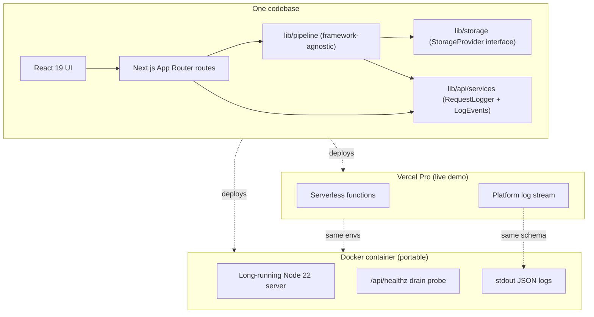

# Docker — AdSpark container deployment

AdSpark ships with a production-ready container so anyone can run the full stack without installing Node, npm, or native image-processing dependencies. This document is the complete reference for the container story.

**The container is an additive portability target.** Vercel remains the live demo URL in the main README; the container is the "same code, every other platform" story (ECS, Fly.io, Cloud Run, self-host).

## Quick start

```bash
# 1. Copy the env template and fill in your OpenAI key
cp .env.docker.example .env.docker
#    edit .env.docker  →  OPENAI_API_KEY=sk-proj-...

# 2. Build + run
docker compose up --build

# 3. Browse
#    http://localhost:3000
```

First build takes ~2-3 minutes (pulls base image, installs deps, runs `next build`). Subsequent builds are cached and complete in seconds.

## Deploy targets — one codebase, two targets



Both deploy targets share:

- **The same `StorageProvider` abstraction** — `STORAGE_MODE=local` or `STORAGE_MODE=s3` works identically in both
- **The same typed error envelope** — `lib/api/errors.ts` is the authoritative contract, serverless and long-running alike
- **The same structured JSON logs** — `vercel logs` and `docker logs adspark | jq .` consume the exact same event schema (see [Observability](#observability--structured-json-logs))
- **The same `/api/healthz` contract** — returns the full timeout cascade so operators can verify their reverse-proxy config matches

## Container design decisions (with file:line citations)

Every opinionated choice in the container is documented at its source so reviewers can verify it in the diff:

| Decision | File | Rationale |
|---|---|---|
| **Node 22** base (not 20) | [`Dockerfile`](../Dockerfile) L28 | Node 20 reaches EOL April 2026. Shipping on a maintenance-mode runtime in an Adobe review is avoidable. |
| **No Alpine** — `bookworm-slim` | [`Dockerfile`](../Dockerfile) L28 | `@napi-rs/canvas` does not ship musl prebuilts. Alpine would break at runtime; debian-slim keeps the glibc guarantee. |
| **Two-stage build, no prod-deps stage** | [`Dockerfile`](../Dockerfile) L23-L55 | Next.js standalone output bundles its own pruned `node_modules`. A third stage with `npm ci --omit=dev` would duplicate work and grow the image. |
| **BuildKit cache mount for `npm ci`** | [`Dockerfile`](../Dockerfile) L40-L41 | Repeat builds skip the network round trip without bloating the image layer. Requires `# syntax=docker/dockerfile:1.6` declaration at L1. |
| **Non-root user `adspark:nodejs`** (UID 1001) | [`Dockerfile`](../Dockerfile) L79-L83 | Container-escape mitigation. Matches the convention from the official `node` images. |
| **Absolute `LOCAL_OUTPUT_DIR=/app/output`** | [`Dockerfile`](../Dockerfile) L73 | Next.js standalone changes `process.cwd()` to `/app/.next/standalone` at startup. A relative `./output` would silently resolve into the standalone subdirectory and the volume mount would miss. Absolute path pins the directory. |
| **Named volume `adspark-output` (not bind mount)** | [`docker-compose.yml`](../docker-compose.yml) L57-L64 | Linux bind mounts suffer host↔container UID mismatch — host UID 1000 ≠ container UID 1001 = `EACCES` on first write. Named volumes inherit ownership from the image layer. |
| **`stop_grace_period: 150s`** | [`docker-compose.yml`](../docker-compose.yml) L70-L78 | Default is 10s. `PIPELINE_BUDGET_MS` is 120s. A request that started at T=0 needs the full budget to drain before SIGKILL. 150s = 120s budget + 30s buffer for response flush. |
| **`deploy.resources.limits` 2GB/2CPU** | [`docker-compose.yml`](../docker-compose.yml) L88-L93 | Sharp + Canvas + parallel DALL-E can peak at 1.5GB on a 6-image brief. 2GB is comfortable headroom. Production deploys can raise this. |
| **Container-level + compose-level `HEALTHCHECK`** | [`Dockerfile`](../Dockerfile) L100-L101 & [`docker-compose.yml`](../docker-compose.yml) L95-L107 | Belt-and-suspenders. `docker run` invocations (no compose) still get a healthcheck from the Dockerfile; compose surfaces the state in `docker compose ps` and enables `depends_on: service_healthy`. |
| **`init: true`** | [`docker-compose.yml`](../docker-compose.yml) L39-L43 | tini as PID 1 forwards SIGTERM/SIGINT to Next.js, which our [`instrumentation.ts`](../instrumentation.ts) handler consumes. Node 20+ handles signals as PID 1 correctly, but `init: true` is belt-and-suspenders for zero cost. |
| **`instrumentation.ts` SIGTERM hook** | [`instrumentation.ts`](../instrumentation.ts) L59-L91 | On SIGTERM, flips a module-level `shuttingDown` flag. `/api/healthz` observes it and returns 503 so the load balancer stops routing new traffic. In-flight requests continue draining until `PIPELINE_BUDGET_MS` caps them. |
| **AbortController preemption** | [`app/api/generate/route.ts`](../app/api/generate/route.ts) L220-L255 | Container has no Vercel 300s function kill. A `setTimeout(PIPELINE_BUDGET_MS)` fires an `AbortController.abort()` that threads through `runPipeline` → `generateImages` → `client.images.generate({signal})` and cancels in-flight OpenAI calls, the retry backoff sleep, AND the next retry attempt — within a single event-loop tick. |
| **`output: "standalone"`** | [`next.config.ts`](../next.config.ts) L17 | Emits `.next/standalone/server.js` with a tree-shaken `node_modules`. Runtime image drops from ~800MB to ~300MB. Vercel ignores this flag (its build produces an equivalent artifact internally) so it's a one-way win. |
| **`outputFileTracingIncludes`** for native deps | [`next.config.ts`](../next.config.ts) L35-L44 | Webpack's file tracer follows JS requires but does NOT follow platform-conditional `.node` binary resolution. Without this, the standalone artifact ships the JS shim for `sharp` and `@napi-rs/canvas` with no native binary and fails at first pipeline call. |
| **Thin `/api/healthz` route delegating to services** | [`app/api/healthz/route.ts`](../app/api/healthz/route.ts) L40-L53 | The route is a 3-line delegate. All logic lives in `getHealth()` in `lib/api/services.ts` so a single unit test covers the contract. |
| **Isolated `lib/api/shutdown.ts` module** | [`lib/api/shutdown.ts`](../lib/api/shutdown.ts) | `instrumentation.ts` runs in both Edge and Node runtimes. It can't import `lib/api/services.ts` directly because that transitively pulls `node:fs` via the storage factory, breaking the edge bundle. A tiny isolated module exposes just `markShuttingDown`/`isShuttingDown` with no transitive node-only imports. |

## Reverse proxy configuration (non-negotiable)

**If you put anything in front of this container, it MUST have a request/idle timeout of at least 140 seconds.**

- `PIPELINE_BUDGET_MS` is 120s (server-side preemption window)
- `CLIENT_REQUEST_TIMEOUT_MS` is 135s (client `AbortSignal` safety net)
- Cloud Run, ALB, and nginx all default to **60 seconds**, which is lower than both

With a 60s proxy timeout, the proxy kills the stream mid-pipeline, the client's `AbortSignal` never fires, and users see an opaque 502/504 from the proxy instead of a typed error envelope from the route handler.

The required minimum is queryable at runtime so you can smoke-test it in CI:

```bash
curl -s http://localhost:3000/api/healthz | jq .recommendedProxyTimeoutMs
# → 140000
```

Set your proxy's idle/request timeout to **at least that value**. Recommended platform defaults:

- **Cloud Run:** `--timeout=300s`
- **ALB:** `IdleTimeoutSeconds: 180`
- **nginx:** `proxy_read_timeout 180s;` + `proxy_send_timeout 180s;`

## Observability — structured JSON logs

The container writes one JSON line per pipeline event to stdout. A single 6-image generation produces ~40-60 events, each carrying a `requestId` so you can grep a full request trace:

```bash
docker logs adspark 2>&1 | grep 40f793a5-66c8
#    ← every event for one request in order
```

Events are grouped by domain prefix:

| Domain | Events | Purpose |
|---|---|---|
| `request.*` | `received`, `complete`, `failed` | Request boundary (entry + exit) |
| `pipeline.*` | `start`, `complete`, `budget.abort` | Pipeline boundary + AbortController firing |
| `stage` | 6 transitions | `validating` → `resolving` → `generating` → `compositing` → `organizing` → `complete` |
| `dalle.*` | `start`, `done`, `failed`, `retry.attempt` | Per-image DALL-E calls with bytes + ms |
| `composite.*` | `done`, `image` | Per-image text overlay compositing |
| `storage.*` | `save`, `save.failed` | Per-file writes with key + bytes |
| `manifest.*` + `brief.*` | `write`, `write.failed` | Manifest + brief snapshot writes |
| `agent.phase.*` | `start`, `done`, `failed` | Multi-agent orchestrator — 7 calls per orchestration (triage, draft, 4 reviewers, synthesis), each with `promptHash`, `tokensIn`, `tokensOut` |
| `shutdown.signal` | — | SIGTERM/SIGINT received, drain starting |

The full event catalog lives in [`lib/api/logEvents.ts`](../lib/api/logEvents.ts) as a single `LogEvents` constant — every emission site in the codebase references it by name, so adding a new event is one edit and grep covers every call site.

## Pipeline budget preemption — how it actually works

Container mode required making the 120s pipeline budget **preemptive** rather than the passive "check elapsed after generation finishes" that worked on Vercel (where the 300s platform kill was the real backstop). The chain:

```
AbortController (fired at PIPELINE_BUDGET_MS by setTimeout in route)
  → runPipeline(options.signal)
    → generateImages(signal)
      → generateImage(signal)
        → client.images.generate({...}, { signal })  ← undici-level cancel
        → withRetry({ signal })                       ← cancels pending backoff sleep
```

A runaway request is cancelled in all three places at once: the in-flight HTTP call, the retry backoff sleep, and the next retry attempt. Without this thread, the container has no upper bound on request duration and the 135s client `AbortSignal` would be the only defense.

The timer is cleared in a `finally` block ([`app/api/generate/route.ts`](../app/api/generate/route.ts) L350-L356) so a successful request does not leak a pending `setTimeout` — a leaked timer would keep the Node event loop alive past the response and, in a container, inflate the graceful-shutdown window for no reason.

## Graceful shutdown — SIGTERM drain flow

1. Docker sends `SIGTERM` to the container's PID 1 (tini, via `init: true`).
2. tini forwards the signal to the Next.js Node process.
3. [`instrumentation.ts`](../instrumentation.ts) catches SIGTERM via `process.on("SIGTERM", ...)` and calls `markShuttingDown()` on the [`lib/api/shutdown.ts`](../lib/api/shutdown.ts) module.
4. The shutdown flag is flipped to `true`.
5. `/api/healthz` starts returning **503** instead of **200**. Load balancers (ALB, Cloud Run, Kubernetes readiness probes) stop routing new traffic to this container.
6. In-flight requests continue — we do NOT close the HTTP listener. Next.js handles that after `stop_grace_period` elapses.
7. The AbortController in each in-flight `/api/generate` still caps each request at `PIPELINE_BUDGET_MS` (120s), so the drain completes within that window.
8. `stop_grace_period: 150s` = 120s budget + 30s buffer for response flush before Docker sends SIGKILL.

## Environment variables

All container env vars live in `.env.docker` (gitignored + dockerignored). The template `.env.docker.example` is committed.

| Variable | Required? | Default | Purpose |
|---|---|---|---|
| `OPENAI_API_KEY` | ✅ | — | DALL-E 3 + gpt-4o-mini |
| `STORAGE_MODE` | — | `local` | `local` or `s3` |
| `S3_BUCKET` | ✅ if `STORAGE_MODE=s3` | — | Target bucket name |
| `S3_REGION` | — | `us-east-1` | AWS region |
| `AWS_ACCESS_KEY_ID` | ✅ if `STORAGE_MODE=s3` | — | IAM user access key |
| `AWS_SECRET_ACCESS_KEY` | ✅ if `STORAGE_MODE=s3` | — | IAM user secret |
| `LOCAL_OUTPUT_DIR` | — | `/app/output` | Override the local output path (absolute) |
| `APP_VERSION` | — | `dev` | Baked via `docker build --build-arg APP_VERSION=1.2.3`; returned by `/api/healthz` |

### The `NEXT_PUBLIC_` trap

Any variable prefixed with `NEXT_PUBLIC_` is **inlined into the client bundle at BUILD time**, not read at runtime. Setting `NEXT_PUBLIC_FOO` in compose's `environment:` block has **NO effect** on the browser bundle.

If you need to expose a public var to the client, add it as a build-arg in the `Dockerfile`:

```dockerfile
ARG NEXT_PUBLIC_FOO
ENV NEXT_PUBLIC_FOO=${NEXT_PUBLIC_FOO}
RUN npm run build
```

Then: `docker compose build --build-arg NEXT_PUBLIC_FOO=bar`

Today there are zero `NEXT_PUBLIC_*` vars in AdSpark — this section is pre-emptive documentation so the trap is visible before anyone falls into it.

## First-run troubleshooting

| Symptom | Cause | Fix |
|---|---|---|
| `ENOENT: open '.env.docker'` | You didn't copy the template | `cp .env.docker.example .env.docker` then edit |
| `OPENAI_API_KEY is required` at boot | Empty placeholder in `.env.docker` | Fill in your real `sk-proj-...` key |
| 404 on every generated image | `LOCAL_OUTPUT_DIR` resolution mismatch | Check `docker compose exec adspark env \| grep LOCAL_OUTPUT_DIR` — should be `/app/output` |
| Container healthcheck shows `unhealthy` | Healthcheck is probing during startup | Wait 30s (the `start_period` grace window). If still unhealthy, `docker logs adspark` and check for startup errors |
| `EACCES: permission denied` writing to `/app/output` | Custom bind mount with wrong UID | Use the default named volume (remove `./output:/app/output` overrides) or `chown -R 1001:1001 ./output` on Linux |
| Reviewer sees 502/504 through nginx/ALB | Proxy idle timeout < 140s | Raise the proxy timeout — see [Reverse proxy configuration](#reverse-proxy-configuration-non-negotiable) above |
| Slow DALL-E times out at 60s | OpenAI SDK per-request timeout | Check `dalle.start` → `dalle.failed` timing in logs; see `getOpenAIClient()` in `lib/api/services.ts` for the timeout value |

## Related files

- [`Dockerfile`](../Dockerfile) — multi-stage build
- [`docker-compose.yml`](../docker-compose.yml) — service definition
- [`.dockerignore`](../.dockerignore) — build context exclusions
- [`.env.docker.example`](../.env.docker.example) — environment template
- [`instrumentation.ts`](../instrumentation.ts) — SIGTERM handler
- [`app/api/healthz/route.ts`](../app/api/healthz/route.ts) — drain probe
- [`lib/api/shutdown.ts`](../lib/api/shutdown.ts) — shutdown flag module
- [`next.config.ts`](../next.config.ts) — standalone output + file tracing
