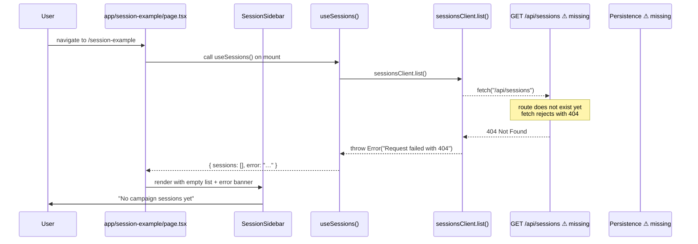
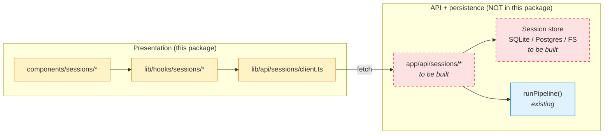

# Session UI Scaffold — Route Layer Preview

> **Status:** Proposed. No files have been copied from `adspark-session-ui-package.zip` yet.
> This document is the **dry run** you requested before applying the 18-file package.
> Scope: post-MVP. See `docs/adr/ADR-013..015` drafts bundled with the package.

## 1. What this preview covers

- Where every staged file lands in the repo.
- The **route-group rename** that keeps `next build` passing.
- A URL map showing which pages and API endpoints exist **before** and **after** the apply.
- A data-flow mermaid diagram showing which calls go live vs. 404 at runtime.
- The "compile-clean but runtime-404" gap you will observe until the API persistence layer ships.

## 2. Current app/ tree (before apply)

```
app/
├── api/
│   ├── campaigns/[id]/route.ts
│   ├── files/[...path]/route.ts
│   ├── generate/route.ts
│   └── upload/route.ts
├── globals.css
├── layout.tsx
└── page.tsx                 ← existing dashboard, unchanged
```

## 3. Proposed app/ tree (after apply)

```
app/
├── api/
│   ├── campaigns/[id]/route.ts
│   ├── files/[...path]/route.ts
│   ├── generate/route.ts
│   └── upload/route.ts
├── globals.css
├── layout.tsx
├── page.tsx                 ← UNCHANGED
└── session-example/         ★ NEW  (renamed from (session-example))
    └── page.tsx             ★ NEW  client component — sidebar + header + runs

components/
└── sessions/                ★ NEW directory
    ├── EmptySessionState.tsx
    ├── SessionHeader.tsx
    ├── SessionList.tsx
    ├── SessionListItem.tsx
    ├── SessionRunHistory.tsx
    ├── SessionSidebar.tsx
    └── types.ts

lib/
├── api/
│   └── sessions/            ★ NEW directory
│       ├── client.ts        (sessionsClient — fetch wrapper, 6 methods)
│       └── dtos.ts          (CampaignSessionDto, GenerationRunDto, …)
└── hooks/
    └── sessions/            ★ NEW directory
        ├── useSessionDetail.ts
        ├── useSessionRuns.ts
        ├── useSessionSelection.ts
        └── useSessions.ts

docs/
├── adr/
│   ├── ADR-013-session-aware-dashboard-navigation.md   ★ NEW (Proposed)
│   ├── ADR-014-separate-session-state-from-generation-state.md  ★ NEW (Proposed)
│   └── ADR-015-sidebar-composition-for-campaign-workspace-ux.md ★ NEW (Proposed)
└── sessions/
    └── route-layer-preview.md  ← this file
```

**Delta:** 18 new files, 0 modified files, 0 deletions.

## 4. The route-group rename (critical fix)

The zip ships the example page at `app/(session-example)/page.tsx`. In Next.js App
Router, parentheses denote a **route group** — the segment is organizational only and
**does not appear in the URL**. So `(session-example)/page.tsx` resolves to `/`,
which would collide with the existing `app/page.tsx` and break `next build` with:

> You cannot have two parallel pages that resolve to the same path. Please check
> `/page` and `/(session-example)/page`.

**Fix applied during copy:** rename to `app/session-example/page.tsx` (no parens →
real segment). The URL becomes `/session-example`, reachable in parallel with the
existing dashboard at `/`.

## 5. URL map

| URL                        | Before    | After     | Served by                              |
| -------------------------- | --------- | --------- | -------------------------------------- |
| `/`                        | Dashboard | Dashboard | `app/page.tsx` (unchanged)             |
| `/session-example`         | 404       | **New**   | `app/session-example/page.tsx`         |
| `POST /api/generate`       | OK        | OK        | `app/api/generate/route.ts` (unchanged)|
| `POST /api/upload`         | OK        | OK        | `app/api/upload/route.ts` (unchanged)  |
| `GET /api/campaigns/{id}`  | OK        | OK        | `app/api/campaigns/[id]/route.ts`      |
| `GET /api/files/{...path}` | OK        | OK        | `app/api/files/[...path]/route.ts`     |
| `GET /api/sessions`        | 404       | **404**   | ⚠ Not in scope — backend not shipped   |
| `POST /api/sessions`       | 404       | **404**   | ⚠ Not in scope — backend not shipped   |
| `GET /api/sessions/{id}`                 | 404 | **404** | ⚠ Not in scope |
| `PUT /api/sessions/{id}/brief`           | 404 | **404** | ⚠ Not in scope |
| `GET /api/sessions/{id}/runs`            | 404 | **404** | ⚠ Not in scope |
| `POST /api/sessions/{id}/generate`       | 404 | **404** | ⚠ Not in scope |

> ⚠ The six `/api/sessions/*` rows are the runtime gap the package README warns
> about. The UI compiles cleanly but every hook that calls `sessionsClient.*` will
> fail with a fetch error until you build the backend + persistence layer.

## 6. Mermaid — route layer after apply

```mermaid
graph TD
  subgraph User["User-facing routes"]
    dashboard["/<br/>app/page.tsx<br/><i>existing dashboard</i>"]
    sessionex["/session-example<br/>app/session-example/page.tsx<br/><i>NEW · preview only</i>"]
  end

  subgraph ExistingAPI["Existing API (stable)"]
    gen["POST /api/generate<br/>→ runPipeline()"]
    up["POST /api/upload<br/>→ two-step init + PUT"]
    camp["GET /api/campaigns/[id]<br/>→ manifest lookup"]
    files["GET /api/files/[...path]<br/>→ local mode file server"]
  end

  subgraph MissingAPI["Missing API (404 until shipped)"]
    sList["GET /api/sessions"]
    sCreate["POST /api/sessions"]
    sGet["GET /api/sessions/{id}"]
    sBrief["PUT /api/sessions/{id}/brief"]
    sRuns["GET /api/sessions/{id}/runs"]
    sGen["POST /api/sessions/{id}/generate"]
  end

  dashboard -.-> gen
  dashboard -.-> up
  dashboard -.-> camp
  dashboard -.-> files

  sessionex -.-> sList
  sessionex -.-> sCreate
  sessionex -.-> sGet
  sessionex -.-> sBrief
  sessionex -.-> sRuns
  sessionex -.-> sGen

  classDef existing fill:#e0f2fe,stroke:#0284c7,color:#0c4a6e;
  classDef new fill:#fef3c7,stroke:#d97706,color:#78350f;
  classDef missing fill:#fee2e2,stroke:#dc2626,color:#7f1d1d,stroke-dasharray: 5 5;

  class dashboard,gen,up,camp,files existing;
  class sessionex new;
  class sList,sCreate,sGet,sBrief,sRuns,sGen missing;
```



## 7. Mermaid — data flow for a single session open

This is the chain a user triggers by opening `/session-example` and clicking a
session in the sidebar. Notice how the chain crosses a compile-time boundary
(solid arrows) and a runtime boundary (dashed arrow) that does not currently
land anywhere — that is the 404 gap.



## 8. Mermaid — what "production-ready" looks like (for comparison)

Not part of this apply. Included so you can see the gap that the follow-up work
has to close before this UI is functional.



## 9. What you will actually see after `npm run dev` + visiting `/session-example`

1. `npm run type-check` → clean.
2. `npm run lint` → clean.
3. `npm run build` → succeeds (proves the route-group rename fixed the parallel-page collision).
4. Browser at `/` → existing dashboard, unchanged.
5. Browser at `/session-example` → sidebar renders with an **error banner**
   ("Failed to load sessions") because `useSessions()` calls `/api/sessions`,
   which 404s.
6. Main canvas shows the **EmptySessionState** component: *"Create or open a
   campaign session."* Clicking **Create new campaign** also 404s.

This is the expected post-apply state. The package delivers compile-clean
scaffolding, not a working feature. Landing this commit is an investment in the
**next** piece of work (API + persistence), not a shippable UX.

## 10. What this apply does NOT do

- Does not modify `app/page.tsx`. The existing dashboard stays exactly as it is.
- Does not modify `components/BriefForm.tsx`. No hydration plumbing.
- Does not wire `/api/generate` to a session. Generation still takes a raw brief.
- Does not install any new npm dependencies. Hooks use plain `useState` / `useEffect`.
- Does not accept any of ADR-013/014/015. They land as "Proposed" drafts only.

## 11. Accept-criteria for the apply commit

- [ ] 18 files copied to the paths in §3.
- [ ] Route-group rename applied (`(session-example)` → `session-example`).
- [ ] `npm run type-check` clean.
- [ ] `npm run lint` clean.
- [ ] `npm run build` clean (proves no parallel-route collision).
- [ ] `app/page.tsx` byte-identical to `main`.
- [ ] This preview file stays in the tree as the commit's design record.

## 12. Rollback

Single commit → single `git revert` or `git reset --hard origin/main`. No data
migration, no storage writes, no state changes. Worst case: drop the branch.
