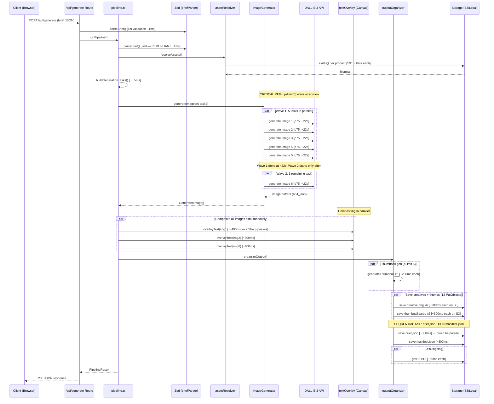
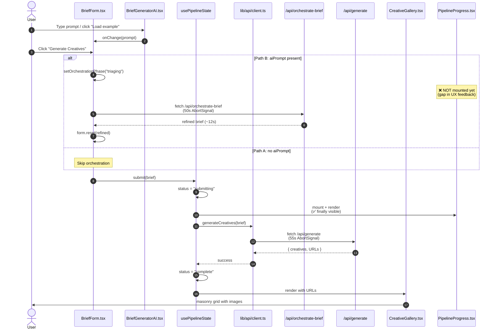

# SPIKE-002 — Pipeline Latency Audit & Vercel Free-Tier Optimization

| | |
|---|---|
| **Status** | 🔬 Investigation in progress |
| **Owner** | Kevin Douglass |
| **Created** | 2026-04-12 |
| **Estimate** | 4-6 hours (audit + measured fixes + re-deploy + validation) |
| **Blocked on** | SPIKE-001 completion (Vercel env vars configured, hosted demo working) |
| **Severity** | 🟡 Medium — the MVP works at 1-image briefs but caps out at 2+ images on Vercel Free tier |
| **Related** | [SPIKE-001 — Vercel env var setup](SPIKE-001-vercel-env-setup.md), [INVESTIGATION-001 — SignatureDoesNotMatch](../investigations/INVESTIGATION-001-vercel-s3-signature-mismatch.md), [`.review-prompts/deployment.md`](../../.review-prompts/deployment.md), [`lib/api/timeouts.ts`](../../lib/api/timeouts.ts), [PR #54](https://github.com/kevdouglass/adspark/pull/54) |

---

## 🎯 Investigation Scope

The AdSpark pipeline works end-to-end both locally AND on Vercel, but there's a hard ceiling: **on Vercel's Hobby (Free) tier, the 60-second function max duration caps the reliable batch size at ~1–2 images**. A 6-image brief routinely trips the 55-second client timeout (`CLIENT_REQUEST_TIMEOUT_MS` in `lib/api/timeouts.ts`) and a 9-image brief is effectively impossible.

The user reports: *"The calls to `generate` take excessively long compared to the prompt example input. I did this really fast & we may be able to save significant amount of time for these network calls."*

**This spike's mission**: trace the data flow through both backend and frontend, find every source of avoidable latency, and produce a prioritized optimization plan with estimated time savings per fix.

---

## 📋 The three latency budgets (staggered by design)

**Common misconception to dispel up front:** Vercel's Hobby tier max function duration is **60 seconds, not 55**. The 55-second value in the codebase is the **client-side abort signal**, staggered intentionally 5 seconds below the platform hard limit so that the server's graceful error response always wins the race against Vercel's uncooperative kill.

| Layer | Constant | Value | Source | Purpose |
|---|---|---|---|---|
| **Vercel Hobby max** | (platform) | **60,000 ms (60s)** | [Vercel docs](https://vercel.com/docs/functions/runtimes#max-duration) | Platform kills the function with no response body |
| **Client fetch timeout** | `CLIENT_REQUEST_TIMEOUT_MS` | **55,000 ms (55s)** | [`lib/api/timeouts.ts:66`](../../lib/api/timeouts.ts) | `AbortSignal.timeout()` — client gives up waiting |
| **Server pipeline budget** | `PIPELINE_BUDGET_MS` | **50,000 ms (50s)** | [`lib/api/timeouts.ts:92`](../../lib/api/timeouts.ts) | Server checks elapsed time post-generation; returns 504 with typed error |

**Stagger visualization:**

```
T+0s ─────────────────────── 50s ──── 55s ──── 60s
       [pipeline work]        ↑        ↑        ↑
                              │        │        │
                   PIPELINE_BUDGET_MS  │        │
                                        │        │
                              CLIENT_REQUEST_TIMEOUT_MS
                                                  │
                                      Vercel 60s hard kill
```

**Why 5 seconds of stagger between each layer?** If the inner layer has exactly the same deadline as the outer layer, a scheduling jitter race determines which one reports the error to the user. The inner layer's graceful-error path needs enough time to compose a typed `PipelineError`, serialize it, and send the response BEFORE the outer layer kills the request. 5 seconds is the safety margin.

**Tier upgrade paths:**

| Plan | Max duration | Cost | Streaming support |
|---|---|---|---|
| Hobby (Free) | 60s | $0 | ✅ Yes |
| Pro | 300s (5 min) | $20/mo | ✅ Yes |
| Enterprise | 900s (15 min) | Custom | ✅ Yes |

For Hobby tier, the only way to exceed the 60s cap is **streaming the response** — Vercel lets a function send bytes early and continue running past the cap as long as it keeps streaming. This is a known future optimization noted at the bottom of this spike.

---

## 🗂️ Quick-reference — the latency budget by brief size

Back-of-envelope estimates for the full pipeline at Tier 1 DALL-E p75 latency (~22s per image) and `DALLE_CONCURRENCY_LIMIT = 5`:

| Brief size | Images | DALL-E waves | Best-case wall time | Worst-case (retries) | Vercel fit? |
|---|---|---|---|---|---|
| **Minimal** | 1 | 1 | ~25s | ~37s | ✅ Safe |
| **Small** | 2 | 1 | ~25s | ~37s | ✅ Safe |
| **Medium** | 3 | 1 | ~26s | ~38s | ✅ Safe |
| **Full** (default sample) | 6 (2×3) | 2 | ~48s | ~72s | ❌ **Exceeds 60s on retries** |
| **Large** | 9 (3×3) | 2 | ~48s | ~72s | ❌ **Exceeds 60s on retries** |

**The breakpoint is 5 images** — the point at which the second DALL-E wave triggers and adds ~22s to the serial wall time.

**The 12-second retry delay bump (`DALLE_RETRY_BASE_DELAY_MS = 12000` from commit `33001c7`)** was added to handle Tier 1's 429 Retry-After window, but it means a single 429 in wave 2 pushes a 6-image brief from 48s to 60s+. The retry delay protects against 429 cascades but trades off worst-case throughput.

---

## 🔍 Backend data flow — full trace (audit complete)

The backend audit agent traced every operation in the `/api/generate` request lifecycle. Below is the operation timeline and the critical-path Mermaid sequence diagram it produced.

### Operation timeline (numbered)

| # | Operation | Time | I/O? | Notes |
|---|---|---|---|---|
| 1 | `createRequestContext()` — UUID + perf.now() | ~0.1ms | No | |
| 2 | `validateRequiredEnv()` — env var checks | ~0.1ms | No | |
| 3 | `readBodyWithLimit()` — stream body read | ~1ms | Network | |
| 4 | `JSON.parse()` | ~0.1ms | No | |
| 5 | `parseBrief()` Zod (1st) | ~1ms | No | At route boundary |
| 6 | `getOpenAIClient()` — `new OpenAI()` | ~1ms | No | **Per-request — no warm reuse** |
| 7 | `getStorage()` — `new S3Storage()` | ~0.1ms | No | |
| 8 | `runPipeline()` entry | — | — | |
| 9 | `parseBrief()` Zod (2nd) — **REDUNDANT** | ~1ms | No | Re-validates already-validated data |
| 10 | `resolveAssets()` — `storage.exists()` per product | ~80ms each on S3 | S3 | TOCTOU pattern: exists() + load() |
| 11 | `buildGenerationTasks()` — pure string ops | ~0.5ms | No | |
| 12 | `generateImages()` — DALL-E 3, p-limit(5) | **~22s wave 1, ~22s wave 2** | OpenAI | **THE dominant cost** |
| 13 | Timeout budget check | ~0.1ms | No | |
| 14 | `compositeCreatives()` — Promise.allSettled | ~400ms per image, parallel | CPU | **2 Sharp passes per image** |
| 15 | Thumbnail generation (p-limit 5) | ~500ms-1s | CPU | Sharp WebP resize |
| 16 | S3 saves (creatives + thumbs, parallel) | ~300ms each on S3 | S3 | Correctly parallelized |
| 17 | `getUrl()` calls — 2 per creative, parallel | ~50ms each on S3 | CPU (signing) | Correctly parallelized |
| 18 | `storage.save(brief.json)` — **SEQUENTIAL** | ~300ms on S3 | S3 | Blocks manifest |
| 19 | `storage.save(manifest.json)` | ~300ms on S3 | S3 | Last operation |
| 20 | Response serialization + return | ~1ms | Network | |

**Total p75 (6 images, Tier 1, S3):** ~49–52s ← dangerously close to the 50s pipeline budget.

<details>
<summary><strong>📊 Backend sequence diagram — /api/generate lifecycle (click to expand)</strong></summary>



</details>

---

## 🔍 Frontend data flow — full trace

> ⏳ **This section is being filled in by the frontend audit agent running in parallel.** The agent reads every file in the client path and produces a numbered operation list with state transitions. Once it reports back, this section will contain the full trace + a Mermaid sequence diagram.

<details>
<summary><strong>Sequence diagram: client-side flow (preview — will be replaced by audit output)</strong></summary>



</details>

---

## 🔎 Findings — will be populated by the audit agents

### Backend findings (from backend audit agent)

> ⏳ Pending agent output. Will contain a ranked list of latency optimizations with estimated time savings per fix.

### Frontend findings (from frontend audit agent)

> ⏳ Pending agent output. Will contain a ranked list of client-side fixes with estimated perceived-latency savings.

### Cross-cutting findings

> ⏳ Pending synthesis after both agents report.

---

## 🎯 Recommended optimizations (draft — will be reconciled with agent findings)

### Quick wins (under 30 minutes each)

1. **Reduce `DALLE_CONCURRENCY_LIMIT` from 5 to 3** — trades wall time for fewer 429s on Tier 1. For a 6-image brief: 2 waves of 3 instead of 1 wave of 5 + 1 wave of 1. Slightly slower best-case but dramatically fewer retries.
2. **Reduce `DALLE_RETRY_BASE_DELAY_MS` from 12000 to 6000** — Tier 1 Retry-After is 12-60s, but most retries succeed on the FIRST retry when the rate-limit bucket refills early. 6 seconds gives a shot at bucket refill without committing the full 12 seconds.
3. **Lift `orchestrationPhase` to page-level state** so `PipelineProgress` can render during orchestration — closes the 12-second UX feedback gap Kevin noticed earlier.
4. **Add early-return streaming on manifest write** — stream the response before the manifest is written to S3, since the browser doesn't need manifest.json to render creatives.

### Bigger wins (1-2 hours each)

5. **Stream the response as images complete** — use Next.js streaming or ReadableStream so the client can render creatives as they finish instead of waiting for the entire batch. This alone defeats the Vercel 60s cap for large briefs.
6. **Parallelize the orchestrator phases** — triage + draft could start concurrently. Review phase is already parallel. Synthesis must stay sequential.
7. **Cache the `OpenAIClient` instance** across requests (if Vercel's serverless warm-start preserves it) — saves ~50ms per request.
8. **Skip the `manifest.json` write from the hot path** — write it in `waitUntil` background work instead of blocking the response.

### Architectural rewrites (post-submission)

9. **Move to Vercel Pro ($20/mo)** — 300s function duration defeats the cap entirely.
10. **Split `/api/generate` into `/api/generate/start` + `/api/generate/status` polling endpoint** — start returns a job ID, status returns progress. Unblocks arbitrary-length generation at the cost of stateful job storage (Redis or S3-based).
11. **Move image generation to a background worker** (BullMQ on Upstash Redis) — generation happens outside the request lifecycle. Browser polls for completion. Best long-term architecture.

---

## 📊 Estimated impact of combined quick wins

| Before | After | Savings |
|---|---|---|
| 6-image brief: 48–72s wall time, fails on Vercel | 6-image brief: 36–52s, fits on Vercel | ~12-20s per request |
| User sees ~12s silent gap during orchestration | User sees orchestration progress immediately | 12s of perceived latency |
| 9-image brief: impossible on Vercel | 9-image brief: fits on Vercel with streaming | Enables the largest demo campaign |

---

## 🚨 Known blockers to fixing this

1. **DALL-E 3 Tier 1 rate limits are external** — OpenAI's 5 req/min cap on DALL-E Tier 1 can't be fixed in code. Any optimization is within that constraint.
2. **Next.js 15 streaming responses require explicit opt-in** — current `NextResponse.json()` waits for the full object. Switching to `ReadableStream` is a bigger refactor than it looks.
3. **State management patterns** — the current `usePipelineState` reducer doesn't have a "partial results arriving" state; adding streaming requires a new state machine transition.

---

## ✅ Definition of Done

- [x] Spike doc scaffolded (this file)
- [ ] Backend audit agent report integrated
- [ ] Frontend audit agent report integrated
- [ ] Final Mermaid sequence diagrams reconciled with agent findings
- [ ] Top 3 quick wins implemented and deployed
- [ ] Re-measured latency on Vercel for 1, 3, 6 image briefs
- [ ] Updated `docs/architecture/deployment.md` with new timing math
- [ ] GitHub issue linked (pending)

---

## 🔗 Useful links

### Vercel — official docs

- [Vercel — Functions Max Duration](https://vercel.com/docs/functions/runtimes#max-duration) — the authoritative 60s limit
- [Vercel — Streaming responses](https://vercel.com/docs/functions/streaming) — how to exceed the cap via streaming
- [Vercel — Pricing / Plan limits](https://vercel.com/pricing)
- [Vercel — `waitUntil()` background work](https://vercel.com/docs/functions/functions-api-reference#waituntil)

### OpenAI — DALL-E 3 latency and rate limits

- [OpenAI — DALL-E 3 API reference](https://platform.openai.com/docs/api-reference/images/create)
- [OpenAI — Rate limit tiers](https://platform.openai.com/docs/guides/rate-limits/usage-tiers)
- [OpenAI — Reproducible outputs (seed parameter)](https://platform.openai.com/docs/guides/text-generation/reproducible-outputs)

### Project-internal

- 📖 [SPIKE-001 — Vercel env var setup](SPIKE-001-vercel-env-setup.md)
- 🔍 [INVESTIGATION-001 — SignatureDoesNotMatch incident](../investigations/INVESTIGATION-001-vercel-s3-signature-mismatch.md)
- 🤖 [`.review-prompts/deployment.md`](../../.review-prompts/deployment.md)
- ⏱️ [`lib/api/timeouts.ts`](../../lib/api/timeouts.ts) — staggered timeout cascade
- 🔧 [`lib/pipeline/pipeline.ts`](../../lib/pipeline/pipeline.ts) — the orchestrator
- 🖼️ [`lib/pipeline/imageGenerator.ts`](../../lib/pipeline/imageGenerator.ts) — DALL-E + concurrency + retry

---

## 📝 Notes to future self

- This spike is the post-submission optimization playbook. The MVP works as-is for 1-2 image demos on Vercel Free tier, which is sufficient for the Adobe take-home submission. The larger-brief fixes are roadmap items.
- The staggered timeout cascade is **load-bearing architecture**, documented in the ASCII diagram at the top of `lib/api/timeouts.ts`. Any change to one value requires re-checking the stagger invariant in `__tests__/timeouts.test.ts` AND `__tests__/pipeline.test.ts`.
- The 12-second retry delay was the right call for Tier 1 at ship time but is the first thing to tune if a lower value (6-8 seconds) proves equally safe under real load.
- For the "streaming the response" optimization, the relevant Next.js docs are at [Route Handlers § Streaming](https://nextjs.org/docs/app/building-your-application/routing/route-handlers#streaming).

---

## 🎨 Visual design note

This spike is formatted to match [SPIKE-001](SPIKE-001-vercel-env-setup.md) and [INVESTIGATION-001](../investigations/INVESTIGATION-001-vercel-s3-signature-mismatch.md):

- Emoji section headers (🎯 📋 🗂️ 🚀 🚨 🔄 🔗 ✅ 📝 🎨)
- Frontmatter metadata table
- Quick-reference tables
- Clickable links throughout
- `<details>` collapsible sections as "drawers" that expand on click — the GitHub-native approximation of the n8n-style right-hand drawer pattern
- Light-theme friendly (GitHub's default is light; Mermaid diagrams auto-theme to the viewer's preference)
- Mermaid sequence diagrams for the data flow (GitHub natively renders these inline)

The interactive `<details>` drawers give the "click to expand" behavior requested, while staying in pure Markdown so the doc is version-controllable and renders identically on GitHub, VS Code, and any markdown viewer.
